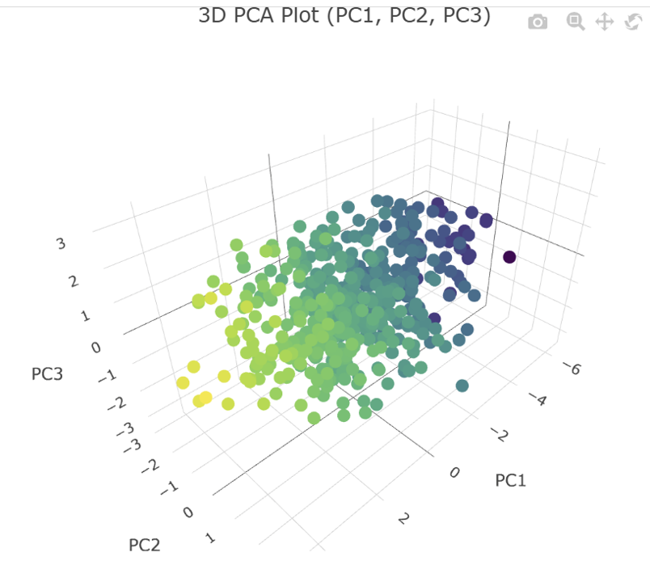

```{=latex}
\newpage
```


```{r setup, include=FALSE}
dir.create("fig", showWarnings = FALSE)

# Defaults common to all outputs
knitr::opts_chunk$set(
  echo     = TRUE,
  message  = FALSE,
  warning  = FALSE,
  fig.align = "center",
  out.width = "100%",
  fig.path  = "fig/",
  dpi       = 300
)

# Output-specific settings
if (knitr::is_latex_output()) {
  knitr::opts_chunk$set(
    fig.width = 6,
    fig.height = 4,
    dev = "pdf",
    fig.pos = "!ht",
    out.extra = ""
  )
} else {
  knitr::opts_chunk$set(
    fig.width = 6,
    fig.height = 4,
    dev = "svglite"  # or "png"
  )
}
```

```{r setup-qol, include=FALSE, echo=FALSE}
#----------------------------- Clean environment ------------------------------#
rm(list = ls()) # Remove all objects
graphics.off() # Close all graphical devices
cat("\014") # Clean console
```

```{r load-dependencies, include=FALSE, echo=FALSE}
#------------------- Load dependencies / external libraries -------------------#
# List of required packages
packages <- c(
  "quantmod",   # for downloadin
  "lavaan",     # for structural equation modelling (SEM) and confirmatory factor analysis
  "haven",      # to import/export SPSS, Stata, and SAS data files
  "cluster",    # for cluster analysis methods (k-means, hierarchical clustering, etc.)
  "MASS",       # for statistical functions and multivariate analysis
  "xts",        # for extensible time series objects (especially financial time series)
  "lubridate",  # for easy handling and manipulation of dates and times
  "TSA",        # for time series analysis (ARIMA, spectral analysis, etc.)
  "labelled",    # for adding and managing variable labels
  "psych",      #  for exploratory factor analysis (EFA)
  "GPArotation", # for factor rotation methods (e.g., varimax, oblimin, promax)
  "ggplot2",   # for data visualisation using the grammar of graphics
  "insuranceData",   # for actuarial and insurance-related example datasets
  "GJRM", # for copula regressions
  "corrplot", # for correlation hitmap method
  "GGally",      # correlation plots and pairwise visualisation
  "reshape2",    # data reshaping (melt, cast)
  "plotly",      # interactive plots
  "dplyr",       # data manipulation
  "knitr",       # report generation (R Markdown tables/figures)
  "kableExtra",   # styling tables for LaTeX/HTML
  "tidyr"         #data tidying and reshaping
)

# Check which packages are already installed
installed <- packages %in% installed.packages()[,"Package"]

# Install any missing packages
if (any(!installed)) {
  install.packages(packages[!installed], dependencies = TRUE)
}

# Load all packages
lapply(packages, library, character.only = TRUE)
```
# Factor Analysis

An exploratory factor analysis (EFA) was conducted on the 25 personality items measured on a 6-point Likert scale. The dataset contained some missing values (NA), which were handled using listwise deletion. In addition, several negatively worded items (X1: empathy, X9: carelessness, X10: idleness, X11: quietness, 
X12: aloofness, X22: avoidance, X25: superficiality) were reverse-coded so that higher values consistently represented higher levels of the underlying traits. 

```{r Q1_data, echo=knitr::is_html_output(), include=FALSE}
## R Markdown

data1 <- read.table("dataset1.txt", header = TRUE)
sum(is.na(data1))
colSums(is.na(data1)) 
data1_clean <- na.omit(data1)

reverse_items <- c("X1","X9","X10","X11","X12","X22","X25")

data1_clean[reverse_items] <- 7 - data1_clean[reverse_items]

var_label(data1_clean$X1)  <- "Be indifferent to the feelings of others"
var_label(data1_clean$X2)  <- "Inquire about others' well-being"
var_label(data1_clean$X3)  <- "Know how to comfort others"
var_label(data1_clean$X4)  <- "Love children"
var_label(data1_clean$X5)  <- "Make people feel at ease"
var_label(data1_clean$X6)  <- "Be exacting in my work"
var_label(data1_clean$X7)  <- "Continue until everything is perfect"
var_label(data1_clean$X8)  <- "Do things according to a plan"
var_label(data1_clean$X9)  <- "Do things in a half-way manner"
var_label(data1_clean$X10) <- "Waste my time"
var_label(data1_clean$X11) <- "Don't talk a lot"
var_label(data1_clean$X12) <- "Find it difficult to approach others"
var_label(data1_clean$X13) <- "Know how to captivate people"
var_label(data1_clean$X14) <- "Make friends easily"
var_label(data1_clean$X15) <- "Take charge"
var_label(data1_clean$X16) <- "Get angry easily"
var_label(data1_clean$X17) <- "Get irritated easily"
var_label(data1_clean$X18) <- "Have frequent mood swings"
var_label(data1_clean$X19) <- "Often feel blue"
var_label(data1_clean$X20) <- "Panic easily"
var_label(data1_clean$X21) <- "Be full of ideas"
var_label(data1_clean$X22) <- "Avoid difficult reading material"
var_label(data1_clean$X23) <- "Carry the conversation to a higher level"
var_label(data1_clean$X24) <- "Spend time reflecting on things"
var_label(data1_clean$X25) <- "Will not probe deeply into a subject"
```

To determine the appropriate number of factors, parallel analysis and the scree plot shown in  figure \@ref(fig:Q1plot1) were examined. The scree plot shows a sharp decline in eigenvalues for the first few components, with eigenvalues of 5.13, 2.75, 2.14, 1.85, 1.55, and 1.07 for the first six components. According to the Kaiser criterion (eigenvalue > 1), up to six components could be retained. However, the sixth eigenvalue (1.07) is very close to the threshold, and the scree plot begins to level off after the fifth component. Considering the overall results from the scree plot and parallel analysis, a five-factor solution was selected for the subsequent factor analysis.

```{r Q1plot1, echo=FALSE, message=FALSE, warning=FALSE, fig.cap=" parallel analysis and Scree plot for determining the number of factors", fig.show='hold', fig.align='center', fig.width=6.2, fig.height=2.9, fig.pos='H', out.width='45%'}

par(mar = c(4,4,1,1))
# Scree plot
fa.parallel(data1_clean, fa = "both", main = "Parallel Analysis")

# PCA
pca1 <- prcomp(data1_clean, scale. = TRUE)
eig <- pca1$sdev^2
pcs <- 1:length(eig)

plot(
  pcs, eig,
  type = "b",
  pch = 19,
  col = "darkgreen",        
  lwd = 2,
  xlab = "Principal Component",
  ylab = "Eigenvalue",
  main = "PCA Scree Plot",
  cex.main = 1.4,
  cex.lab = 1.2,
  cex.axis = 1.1,
  ylim = c(0, max(eig) + 0.3)
)

lines(pcs, eig, col = "red", lwd = 1.5)

idx <- which(eig >= 1)

text(
  pcs[idx] + 0.15,        
  eig[idx],               
  labels = round(eig[idx], 2),
  cex = 0.85,            
  col = "darkblue",
  pos = 4                
)

abline(h = 1, col = "red", lwd = 1.5, lty = 2)

```

Figure \@ref(fig:q1plot2) shows the rotated factor loading matrices obtained using varimax and promax rotations. Both rotations produce broadly similar loading patterns, suggesting that the factor structure is stable. Most items load strongly on a single factor, with limited cross-loadings. The promax rotation allows correlations between factors and yields slightly clearer clustering of items. \textbf{Overall, the results support the five-factor solution selected from the scree plot and parallel analysis.}


``` {r q1plot2, echo=FALSE, message=FALSE, warning=FALSE, fig.cap="Rotated Factor loadings(Varimax vs Promax)", fig.show='hold', fig.align='center', fig.width=6.2, fig.height=2.9, fig.pos='H', out.width='45%'}


fa5 <- factanal(
  data1_clean,
  factors  = 5,
  rotation = "varimax",
  scores   = "regression"
)

L  <- as.matrix(fa5$loadings)
df <- as.data.frame(as.table(L))   # Var1=Item, Var2=Factor, Freq=Loading
colnames(df) <- c("Item", "Factor", "Loading")

df$Factor <- factor(df$Factor, levels = colnames(L))
df$Item   <- factor(df$Item,   levels = rev(rownames(L)))  

ggplot(df, aes(x = Factor, y = Item, fill = Loading)) +
  geom_tile(color = "white", linewidth = 0.2) +
  scale_fill_gradient2(
    low = "blue", mid = "white", high = "red",
    midpoint = 0, limits = c(-1, 1)
  ) +
  labs(
    title = "Rotated Factor Loadings (Varimax)",
    x = "Factor",
    y = "Item"
  ) +
  theme_minimal(base_size = 12) +
  theme(
    plot.title = element_text(face = "bold", hjust = 0.5),
    panel.grid = element_blank()
  )

fa5_2 <- factanal(
  data1_clean,
  factors  = 5,
  rotation = "promax",
  scores   = "Bartlett"
)

L2  <- as.matrix(fa5_2$loadings)
df2 <- as.data.frame(as.table(L2))   # Var1=Item, Var2=Factor, Freq=Loading
colnames(df2) <- c("Item", "Factor", "Loading")

df2$Factor <- factor(df2$Factor, levels = colnames(L2))
df2$Item   <- factor(df2$Item,   levels = rev(rownames(L2)))  

ggplot(df2, aes(x = Factor, y = Item, fill = Loading)) +
  geom_tile(color = "white", linewidth = 0.2) +
  scale_fill_gradient2(
    low = "blue", mid = "white", high = "red",
    midpoint = 0, limits = c(-1, 1)
  ) +
  labs(
    title = "Rotated Factor Loadings (Promax)",
    x = "Factor",
    y = "Item"
  ) +
  theme_minimal(base_size = 12) +
  theme(
    plot.title = element_text(face = "bold", hjust = 0.5),
    panel.grid = element_blank()
  )

```

``` {r q1table, echo=FALSE, message=FALSE, warning=FALSE}

uniq <- summary(fa5$uniquenesses)
uniq_df <- as.data.frame(t(uniq))

uniq_wide <- uniq_df %>%
  select(Var2, Freq) %>%
  pivot_wider(names_from = Var2, values_from = Freq)

knitr::kable(
  uniq_wide,
  digits = 3,
  align = "c",
  caption = "Summary of Uniqueness Values",
  booktabs = TRUE
) %>%
  kable_styling(latex_options = "hold_position")
```

Table \@ref(tab:q1table) showes from 0.27 to 0.83, with an average of approximately 0.58, indicating that the extracted factors explain a moderate proportion of variance in the observed items. The rotated factor loadings reveal a clear five-factor structure. \textbf{Factor 1 loads strongly on items related to emotional instability}(X16–X20), suggesting neuroticism}. \textbf{Factor 2 reflects extraversion}, with items describing sociability and interpersonal engagement (X11–X15)}.\textbf{Factor 3 corresponds to conscientiousnes}, capturing organisation, diligence, and careful work behaviour (X6–X10), while \textbf{Factor 4 represents agreeableness}, including empathy and concern for others (X2–X5). Finally, \textbf{Factor 5 is associated with openness to experience}, reflecting intellectual curiosity and reflective thinking (X21–X25).

```{=latex}
\newpage
```


# copula analysis 

```{r Q2, echo=knitr::is_html_output(), include=TRUE}
# library(GJRM)
# library(insuranceData)

data(dataCar)

data_cop <- subset(dataCar,
                   numclaims > 0 & claimcst0 > 0 & 
			 is.finite(claimcst0) & is.finite(exposure) & 
	   	   	 exposure > 0)

eq1 <- numclaims ~ 1
eq2 <- claimcst0 ~ 1

#claim frequency distribution
#use offset since exposure is not constant
#truncated frequency

tPfreq <- GJRM::gamlss(list(eq1), family = "tP", data = data_cop, offset = data_cop$exposure)
tNBIfreq <- GJRM::gamlss(list(eq1), family = "tNBI", data = data_cop, offset = data_cop$exposure)
tNBIIfreq <- GJRM::gamlss(list(eq1), family = "tNBII", data = data_cop, offset = data_cop$exposure)
tPIGfreq <- GJRM::gamlss(list(eq1), family = "tPIG", data = data_cop, offset = data_cop$exposure) 

print(AIC(tPfreq, tNBIfreq, tNBIIfreq, tPIGfreq))
print(BIC(tPfreq, tNBIfreq, tNBIIfreq, tPIGfreq))
```


```{r}
conv.check(tPfreq)
res.check(tPfreq)
summary(tPfreq)
```


TODO: Marcella put her analysis results here

it's using markdown syntax.

Example latex:
$$
x+1
$$


```{r}

#claim severity distribution

LNsev <- GJRM::gamlss(list(eq2), family="LN", data=data_cop)
IGsev <- GJRM::gamlss(list(eq2), family="IG", data=data_cop)
GAsev <- GJRM::gamlss(list(eq2), family="GA", data=data_cop)

WEIsev <- GJRM::gamlss(list(eq2), family="WEI", data=data_cop)
SMsev <- GJRM::gamlss(list(eq2), family="SM", data=data_cop)
FISKsev <- GJRM::gamlss(list(eq2), family="FISK", data=data_cop)
DAGUMsev <- GJRM::gamlss(list(eq2), family="DAGUM", data=data_cop)

print(AIC(DAGUMsev, LNsev, WEIsev, IGsev, GAsev, SMsev, FISKsev))
print(BIC(DAGUMsev, LNsev, WEIsev, IGsev, GAsev, SMsev, FISKsev))
```


```{r}

conv.check(IGsev)
res.check(IGsev)
summary(IGsev)
```


```{r}

###fitting copula
ZTPIGN <- gjrm(list(eq1, eq2, ~1, ~1), data = data_cop, margin = c("tP", "IG"), model = "B", copula = "N")
ZTPIGT <- gjrm(list(eq1, eq2, ~1, ~1), data = data_cop, margin = c("tP", "IG"), model = "B", copula = "T")
```


```{r}
print(AIC(ZTPIGN, ZTPIGT))
```

```{=latex}
\newpage
```

# Principal Component Analysis

We applied Principal Component Analysis (PCA), an unsupervised dimensionality-reduction method, to transform the 11 variables into a smaller set of uncorrelated components that successively explain the maximum possible variance. Variables were standardised using z-scores before PCA because features are in different units, e.g., income vs age vs rating scores. Without scaling, high-variance variables can dominate PC1 purely due to measurement scale rather than the real underlying structure in the data.

```{r Q3 data, echo=knitr::is_html_output(), include=FALSE}
## R Markdown

data3 <- read.table("dataset3.txt", header = TRUE)
data3 <- na.omit(data3)
colnames(data3) <- c(
  "INC",
  "AGE",
  "SPEND",
  "SHOP",
  "LOYAL",
  "WEB",
  "SOCIAL",
  "EMAIL",
  "SAT",
  "PROMO",
  "CART"
)

# PCA with standardisation
pr.out <- prcomp(data3, scale.  = TRUE)

# variance explained
pr.var <- pr.out$sdev^2
pve <- pr.var / sum(pr.var)

```


```{r Q3 PLOT1, eval=knitr::is_html_output(), echo=FALSE}

ggplot(data.frame(PC = 1:length(pve), PVE = pve), aes(x = PC, y = PVE)) +
  geom_line(color = "red", size = 1) +
  geom_point(size = 3, color = "darkgreen") +
  geom_text(
    aes(label = round(PVE, 2)),
    vjust = -0.8,
    color = "black",
    size = 4
  ) +
  ylim(0, 1) +
  labs(title = "Scree Plot with PVE", x = "Principal Component", y = "Proportion of Variance Explained") +
  theme_minimal()

```

The first three principal components explain approximately 55% of the total variance, which is sufficient to summarise the main behavioural patterns in the data. Parallel analysis was also examined to determine the appropriate number of components. Although the test suggests retaining two components, the third component still contributes meaningful interpretability and increases the cumulative variance explained. Therefore, three components were retained for further interpretation.

```{r Q3plot2, echo=FALSE, message=FALSE, warning=FALSE, fig.cap="Cumulative variance, parallel analysis.", fig.show='hold', fig.align='center', fig.width=6.2, fig.height=3, fig.pos='H', out.width='45%'}      

par(mar = c(4,4,1,1))

cum_pve <- cumsum(pve)

ggplot(data.frame(PC = 1:length(cum_pve), CUM = cum_pve), aes(x = PC, y = CUM)) +
  geom_line(color = "red", size = 0.6) +
  geom_point(size = 1.6, color = "darkgreen") +
  geom_hline(yintercept = 0.6,
             linetype = "dashed",
             color = "red") +
  geom_text(
    aes(label = round(CUM, 2)),
    vjust = -0.6,
    color = "black",
    size = 2.4
  ) +
  ylim(0, 1.05) +
  labs(title = "Cumulative Variance Explained", x = "Principal Component", y = "Cumulative PVE") +
  theme_minimal(base_size = 8)

# op <- par(cex=0.5, mar=c(3,3,2,1))
fa.parallel(data3, fa="both", main="Parallel analysis")
# par(op)

```

The rotated loading plot suggests that RC1 is mainly driven by purchasing behaviour, with income, brand loyalty, shopping frequency, and spending score loading strongly on this component, indicating a dimension of purchasing intensity. RC2 is primarily associated with age and spending score, indicating a contrast between younger high-spending customers and older customers, noting that the sign of loadings is arbitrary. RC3 captures variation in marketing channel engagement: promotion usage and email engagement load positively, whereas social media engagement loads negatively, indicating different preferences across communication channels. Overall, the three rotated components summarise customer behaviour into purchasing intensity, demographic influence, and marketing responsiveness, providing a simplified representation of the main behavioural patterns in the data.

```{r Q3plot3, echo=FALSE, message=FALSE, warning=FALSE, fig.cap="Heatmap and loading plot of the rotated PCA loadings using varimax rotation.", fig.show='hold', fig.align='center', fig.width=6.2, fig.height=3, fig.pos='H', out.width='45%'}

pca_rot <- principal(scale(data3), nfactors=3, rotate="varimax")

load_rot <- as.data.frame(pca_rot$loadings[,1:3])
load_rot$var <- rownames(load_rot)

df_q3 <- melt(as.matrix(load_rot[,1:3]))

ggplot(df_q3, aes(Var2, Var1, fill=value)) +
  geom_tile() +
  scale_fill_gradient2(low="blue", high="red", mid="white") +
  labs(title="Rotated Loadings Heatmap(varimax)",
       x="Factors", y="Variables") +
  theme_minimal() +
  theme(plot.title = element_text(hjust = 0.5))

load2_rot <- as.data.frame(unclass(pca_rot$loadings[, 1:2]))
colnames(load2_rot) <- c("RC1", "RC2")
load2_rot$var <- rownames(load2_rot)

ggplot(load2_rot, aes(x = RC1, y = RC2, label = var)) +
  geom_hline(yintercept = 0, linewidth = 0.3) +
  geom_vline(xintercept = 0, linewidth = 0.3) +
  geom_segment(aes(x = 0, y = 0, xend = RC1, yend = RC2),
               linewidth = 0.4,
               col = "red",
               arrow = arrow(length = unit(0.08, "inches"))) +
  geom_text(size = 2.4, vjust = -0.4) +
  coord_equal() +
  labs(title = "Rotated Loadings Plot (Varimax)",
       x = "RC1 loading", y = "RC2 loading") +
  theme_minimal(base_size = 8)

```


``` {r q31table, echo=FALSE, message=FALSE, warning=FALSE, results='asis'}

df_q3 <- melt(as.matrix(load_rot[, 1:3]))
colnames(df_q3) <- c("Variable", "Factor", "Loading")

df_q3_matrix <- df_q3 %>%
  mutate(
    Factor = factor(Factor, levels = paste0("RC", 1:3)),
    Loading = ifelse(abs(Loading) >= 0.40, round(Loading, 2), NA)
  ) %>%
  pivot_wider(
    names_from = Variable,
    values_from = Loading
  ) %>%
  arrange(Factor) %>%
  mutate(across(-Factor, ~ifelse(is.na(.), "", sprintf("%.2f", .))))

kable(
  df_q3_matrix,
  align = c("l", rep("c", ncol(df_q3_matrix) - 1)),
  caption = "Rotated PCA loadings after varimax rotation (|loading| ≥ 0.40))",
  booktabs = TRUE
) %>%
  kable_styling(
    latex_options = c("hold_position", "scale_down"),
    full_width = FALSE,
    font_size = 9
  )

```


```{=latex}
\newpage
```

# Time seires

# Appendix

## bonus : Q1 Factor analysis comparison(number of factors 5 vs 6)

The heatmaps compare the rotated factor loading structures obtained from the five-factor and six-factor solutions using varimax rotation. In the five-factor solution, items generally load strongly on a single factor, producing a relatively clear and interpretable structure. When a sixth factor is introduced, several items show weaker or more dispersed loadings across factors, suggesting a less stable structure. In particular, the additional sixth factor captures only a limited number of items and does not form a clearly interpretable dimension. Therefore, the five-factor solution appears more parsimonious and provides a more coherent representation of the underlying personality traits.


```{r appq1, echo=FALSE, message=FALSE, warning=FALSE, fig.cap="Comparison of the number of factors (5 vs 6)", fig.show='hold', fig.align='center', fig.width=6, fig.height=3.2, fig.pos='H', out.width='45%'}

fa5 <- factanal(
  data1_clean,
  factors  = 5,
  rotation = "varimax",
  scores   = "regression"
)

L  <- as.matrix(fa5$loadings)
df <- as.data.frame(as.table(L))   # Var1=Item, Var2=Factor, Freq=Loading
colnames(df) <- c("Item", "Factor", "Loading")

df$Factor <- factor(df$Factor, levels = colnames(L))
df$Item   <- factor(df$Item,   levels = rev(rownames(L)))  

ggplot(df, aes(x = Factor, y = Item, fill = Loading)) +
  geom_tile(color = "white", linewidth = 0.2) +
  scale_fill_gradient2(
    low = "blue", mid = "white", high = "red",
    midpoint = 0, limits = c(-1, 1)
  ) +
  labs(
    title = "Rotated Factor Loadings (Varimax) for factor 5",
    x = "Factor",
    y = "Item"
  ) +
  theme_minimal(base_size = 12) +
  theme(
    plot.title = element_text(face = "bold", hjust = 0.5),
    panel.grid = element_blank()
  )

fa6 <- factanal(
  data1_clean,
  factors  = 6,
  rotation = "varimax",
  scores   = "regression"
)

L6  <- as.matrix(fa6$loadings)
df6 <- as.data.frame(as.table(L6))   # Var1=Item, Var2=Factor, Freq=Loading
colnames(df6) <- c("Item", "Factor", "Loading")

df6$Factor <- factor(df6$Factor, levels = colnames(L6))
df6$Item   <- factor(df6$Item,   levels = rev(rownames(L6)))  
ggplot(df6, aes(x = Factor, y = Item, fill = Loading)) +
  geom_tile(color = "white", linewidth = 0.2) +
  scale_fill_gradient2(
    low = "blue", mid = "white", high = "red",
    midpoint = 0, limits = c(-1, 1)
  ) +
  labs(
    title = "Rotated Factor Loadings (Varimax) for factor 6",
    x = "Factor",
    y = "Item"
  ) +
  theme_minimal(base_size = 12) +
  theme(
    plot.title = element_text(face = "bold", hjust = 0.5),
    panel.grid = element_blank()
  )

```
The rotated factor loading tables allow a comparison between the five-factor and six-factor solutions. In the five-factor model, the items cluster clearly into five interpretable groups, with most salient loadings above 0.40 concentrated on a single factor. In contrast, the six-factor solution does not substantially improve the structure, as the additional sixth factor (F6) does not show any strong loadings above the threshold. Most items continue to load on the same factors as in the five-factor solution, indicating that the extra factor does not capture a distinct dimension. Therefore, the five-factor model appears more parsimonious and provides a clearer and more interpretable representation of the underlying personality structure.

``` {r appq1table, echo=FALSE, message=FALSE, warning=FALSE, results='asis'}

df5_matrix <- df %>%
 mutate(
    Factor = gsub("Factor", "F", Factor),
    Factor = factor(Factor, levels = paste0("F", 1:5)),
    Loading = ifelse(abs(Loading) >= 0.40, round(Loading, 2), NA)
  ) %>%
  pivot_wider(
    names_from = Item,
    values_from = Loading
  ) %>%
  arrange(Factor) %>%
  mutate(across(-Factor, ~ifelse(is.na(.), "", sprintf("%.2f", .))))


kable(
  df5_matrix,
  align = c("l", rep("c", ncol(df5_matrix)-1)),
  caption = "Rotated Factor Loadings for 5 Factors (|loading| ≥ 0.40)",
  booktabs = TRUE
) %>%
  kable_styling(
    latex_options = c("hold_position", "scale_down"),
    full_width = FALSE,
    font_size = 9
  )


```


``` {r appq2table, echo=FALSE, message=FALSE, warning=FALSE, results='asis'}

df6_matrix <- df6 %>%
  mutate(
    Factor = gsub("Factor", "F", Factor),
    Factor = factor(Factor, levels = paste0("F", 1:6)),
    Loading = ifelse(abs(Loading) >= 0.40, round(Loading, 2), NA)
  ) %>%
  pivot_wider(
    names_from = Item,
    values_from = Loading
  ) %>%
  arrange(Factor) %>%
  mutate(across(-Factor, ~ifelse(is.na(.), "", sprintf("%.2f", .))))

kable(
  df6_matrix,
  align = c("l", rep("c", ncol(df6_matrix) - 1)),
  caption = "Rotated Factor Loadings for 6 Factors (|loading| ≥ 0.40)",
  booktabs = TRUE
) %>%
  kable_styling(
    latex_options = c("hold_position", "scale_down"),
    full_width = FALSE,
    font_size = 9
  )


```

```{=latex}
\newpage
```

## bonus : Q2 Coupla

```{=latex}
\newpage
```

## bonus : Q3 Principal Component Analysis

The correlation matrix shows generally weak to moderate correlations among variables, suggesting that several variables related to purchasing behaviour (spending score, Shopping Frequency, and Brand loyalty) are strongly positively correlated. PC1 contrasts purchasing intensity (spending score, shopping frequency, and brand loyalty) against age, suggesting that older customers tend to have lower purchasing-intensity scores on this component( here can add scatterplot as evidence to support if have space).

```{r Q3Cor, echo=FALSE, message=FALSE, warning=FALSE, fig.cap="Correlation matrix (numbers left, heatmap right)", fig.show='hold', fig.align='center', fig.width=7, fig.height=3.2, fig.pos='H', out.width='45%'}
      
corrplot(cor(data3),
         method="number",
         type="upper",
         tl.cex = 0.25, number.cex = 0.65, tl.srt = 45, cl.cex=0.45)

corrplot(cor(data3),
         method="color",
         type="upper",
         col=colorRampPalette(c("blue","white","red"))(200),
         tl.cex = 0.25, number.cex = 0.4, tl.srt = 45, cl.cex=0.45)

```

The scree plot suggests retaining three to four components. Although the Kaiser criterion indicates four components (eigenvalue > 1), the elbow in the scree plot and the interpretability of the rotated loadings support retaining three components.

```{r Q3screeplot, echo=FALSE, message=FALSE, warning=FALSE,fig.cap="Scree plot",fig.show='hold',fig.align='center',fig.width=7,fig.height=3.2,fig.pos='H',out.width='100%'}

pca3 <- prcomp(data3, scale. = TRUE)
eig3 <- pca3$sdev^2
pcs3 <- 1:length(eig3)

plot(
  pcs3, eig3,
  type = "b",
  pch = 19,
  col = "darkgreen",        
  lwd = 2,
  xlab = "Principal Component",
  ylab = "Eigenvalue",
  main = "PCA Scree Plot",
  cex.main = 1.4,
  cex.lab = 1.2,
  cex.axis = 1.1,
  ylim = c(0, max(eig) + 0.3)
)

lines(pcs3, eig3, col = "red", lwd = 1.5)

idx <- which(eig3 >= 1)

text(
  pcs3[idx] + 0.15,        
  eig3[idx],               
  labels = round(eig3[idx], 2),
  cex = 0.85,            
  col = "darkblue",
  pos = 4                
)

abline(h = 1, col = "red", lwd = 1.5, lty = 2)
```

The scatter plot shows the distribution of observations in the space of the first two principal components, with clusters identified using k-means clustering. The results suggest three groups of customers with different behavioural patterns. One group is associated with higher purchasing intensity (high PC1 values), while another group corresponds to lower purchasing activity. The third group lies between these extremes, representing customers with moderate purchasing behaviour.

```{r Q3clusterlot, echo=FALSE, message=FALSE, warning=FALSE,fig.cap="Scatter plot",fig.show='hold',fig.align='center',fig.width=7,fig.height=3.2,fig.pos='H',out.width='100%'}


km <- kmeans(data3, centers = 3)
scores <- data.frame(pr.out$x)
scores2 <- data.frame(pr.out$x[,1:2], cluster = factor(km$cluster))
scores3 <- data.frame(pr.out$x[, 1:3])


 ggplot(scores2, aes(PC1, PC2, color = cluster)) +
  geom_point() +
  theme_minimal() +
  annotate("text", x = -3, y = 2.5, label = "Lower purchasing activity", size = 3.5) +
  annotate("text", x = 2.5, y = -2, label = "Higher purchasing intensity", size = 3.5) +
  annotate("text", x = 0.5, y = 0.5, label = "Moderate customers", size = 3.5)
 
```

The PCA biplot illustrates both the observations and the directions of the original variables in the space of the first two principal components. Variables related to purchasing behaviour, such as income, brand loyalty, shopping frequency, and spending score, are largely aligned with the direction of PC1, indicating their strong contribution to this component. In contrast, age is oriented in a different direction, suggesting that it captures a different aspect of variation in the data. Overall, the biplot confirms that purchasing-related variables primarily drive the variation explained by the first principal component.

```{r Q3biplot, echo=FALSE, message=FALSE, warning=FALSE,fig.cap="PCA Biplot",fig.show='hold',fig.align='center',fig.width=7,fig.height=3.2,fig.pos='H',out.width='100%'}

scores <- as.data.frame(pr.out$x[,1:2])
loadings <- as.data.frame(pr.out$rotation[,1:2])
loadings$var <- rownames(loadings)

ggplot(scores, aes(PC1, PC2)) +
  geom_point(alpha = 0.6, color = "darkgreen") +
  geom_segment(data = loadings,
               aes(x = 0, y = 0, xend = PC1*3, yend = PC2*3),
               arrow = arrow(length = unit(0.2,"cm")),
               color = "red") +
  geom_text(data = loadings,
            aes(x = PC1*3, y = PC2*3, label = var),
            color = "red", size = 3) +
  theme_minimal() 

```

The three-dimensional PCA score plot provides a visual representation of the observations across the first three principal components. The points form a continuous distribution rather than clearly separated clusters, indicating that customer behaviour varies gradually across the dataset. This visualization further supports the interpretation that the main variation in the data is captured by the first few principal components.

```{r principal3d, echo=FALSE, fig.cap="3D PCA score plot of the first three principal components. ", out.width="80%", fig.pos="!ht"}

```

``` {r 12312, echo=knitr::is_html_output(), include=TRUE, eval=FALSE}
km <- kmeans(data3, centers = 3)
scores <- data.frame(pr.out$x)
scores2 <- data.frame(pr.out$x[,1:2], cluster = factor(km$cluster))
scores3 <- data.frame(pr.out$x[, 1:3])

plot_ly(scores3,
        x = ~PC1,
        y = ~PC2,
        z = ~PC3,
        type = "scatter3d",
        mode = "markers",
        marker = list(size = 3, color = scores3$PC1, colorscale = "Viridis")) %>%
  layout(title = "3D PCA Plot (PC1, PC2, PC3)")
  
```

```{=latex}
\newpage
```

## bonus : Q4 Time series
