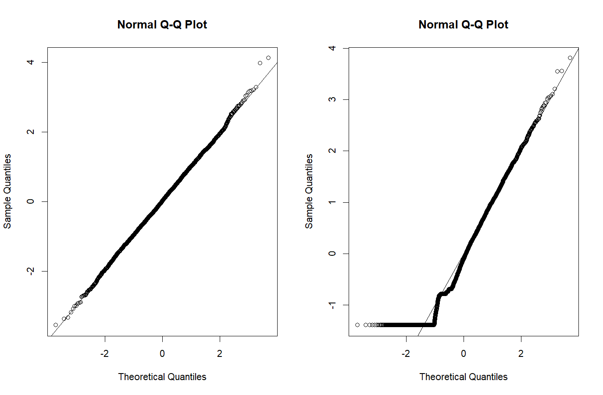
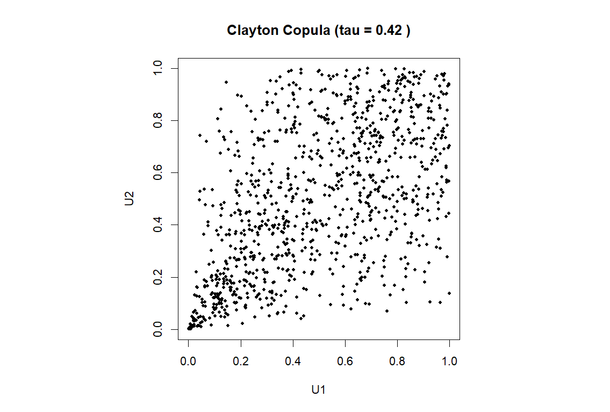
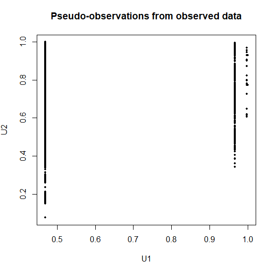
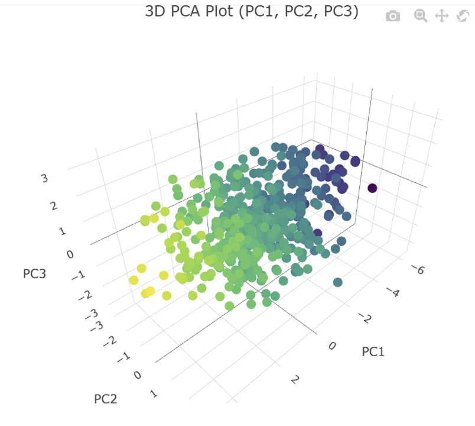

```{=latex}
\newpage
```


```{r setup, include=FALSE}
dir.create("fig", showWarnings = FALSE)

# Defaults common to all outputs
knitr::opts_chunk$set(
  echo     = TRUE,
  message  = FALSE,
  warning  = FALSE,
  fig.align = "center",
  out.width = "100%",
  fig.path  = "fig/",
  dpi       = 300
)

# Output-specific settings
if (knitr::is_latex_output()) {
  knitr::opts_chunk$set(
    fig.width = 6,
    fig.height = 4,
    dev = "pdf",
    fig.pos = "!ht",
    out.extra = ""
  )
} else {
  knitr::opts_chunk$set(
    fig.width = 6,
    fig.height = 4,
    dev = "svglite"  # or "png"
  )
}
```

```{r setup-qol, include=FALSE, echo=FALSE}
#----------------------------- Clean environment ------------------------------#
rm(list = ls()) # Remove all objects
graphics.off() # Close all graphical devices
cat("\014") # Clean console
```

```{r load-dependencies, include=FALSE, echo=FALSE}
#------------------- Load dependencies / external libraries -------------------#
# List of required packages
packages <- c(
  "quantmod",   # for downloadin
  "lavaan",     # for structural equation modelling (SEM) and confirmatory factor analysis
  "haven",      # to import/export SPSS, Stata, and SAS data files
  "cluster",    # for cluster analysis methods (k-means, hierarchical clustering, etc.)
  "MASS",       # for statistical functions and multivariate analysis
  "xts",        # for extensible time series objects (especially financial time series)
  "lubridate",  # for easy handling and manipulation of dates and times
  "TSA",        # for time series analysis (ARIMA, spectral analysis, etc.)
  "labelled",    # for adding and managing variable labels
  "psych",      #  for exploratory factor analysis (EFA)
  "GPArotation", # for factor rotation methods (e.g., varimax, oblimin, promax)
  "ggplot2",   # for data visualisation using the grammar of graphics
  "insuranceData",   # for actuarial and insurance-related example datasets
  "GJRM", # for copula regressions
  "corrplot", # for correlation hitmap method
  "GGally",      # correlation plots and pairwise visualisation
  "reshape2",    # data reshaping (melt, cast)
  "plotly",      # interactive plots
  "dplyr",       # data manipulation
  "knitr",       # report generation (R Markdown tables/figures)
  "kableExtra",   # styling tables for LaTeX/HTML
  "tidyr"         #data tidying and reshaping
)

# Check which packages are already installed
installed <- packages %in% installed.packages()[,"Package"]

# Install any missing packages
if (any(!installed)) {
  install.packages(packages[!installed], dependencies = TRUE)
}

# Load all packages
lapply(packages, library, character.only = TRUE)
```
# Factor Analysis

An exploratory factor analysis (EFA) was conducted on the 25 personality items measured on a 6-point Likert scale. Missing values (NA) were handled using listwise deletion. In addition, several negatively worded items (X1: empathy, X9: carelessness, X10: idleness, X11: quietness, X12: aloofness, X22: avoidance, and X25: superficiality) were reverse-coded so that higher values consistently represented higher levels of the underlying traits.

To determine the appropriate number of factors, parallel analysis, principal component analysis (PCA) in Figure \@ref(fig:Q1plot11), and the scree plot in Figure \@ref(fig:Q1plot12) were examined. The scree plot shows a sharp decline in eigenvalues for the first components (5.13, 2.75, 2.14, 1.85, 1.55, and 1.07). According to the Kaiser criterion (eigenvalue > 1), up to six components could be retained. However, the sixth eigenvalue is only slightly above the threshold, and the scree plot levels off after the fifth component, suggesting that additional components contribute little to explaining the overall variance. Considering these results, a five-factor solution was selected. For completeness, the comparison between the five- and six-component solutions obtained using PCA is provided in the Appendix.

After determining the number of factors, the factor loading matrices were estimated and rotated to improve interpretability. Figure \@ref(fig:q1plot2) presents the rotated factor loading matrices obtained using both varimax and promax rotations. The two rotation methods produce broadly similar loading patterns, suggesting that the underlying factor structure is relatively stable. In most cases, items load strongly on a single factor, while cross-loadings across multiple factors remain limited. The promax rotation allows correlations between factors and produces slightly clearer clustering of items, although the overall interpretation of the factor structure remains consistent across the two rotation methods.

The uniqueness values reported in Table \@ref(tab:q1table) ranges from 0.27 to 0.83, with an average of approximately 0.58. This indicates that the extracted factors explain a moderate proportion of the variance in the observed items. The rotated factor loadings reveal a clear five-factor structure consistent with widely recognised personality dimensions. **Factor 1** loads strongly on items related to **emotional instability** (X16–X20), suggesting that this factor represents neuroticism. **Factor 2** reflects **extraversion**, with items describing sociability and interpersonal engagement (X11–X15). **Factor 3** corresponds to **conscientiousness**, capturing traits such as organisation, diligence, and careful work behaviour (X6–X10). **Factor 4** represents **agreeableness**, including items related to empathy, cooperation, and concern for others (X2–X5). Finally, **Factor 5** appears to capture **openness**-related characteristics, including curiosity, imagination, and intellectual engagement (X21–X23, X25). Overall, the factor analysis results provide empirical support for a five-factor personality structure within the dataset.

$$
\begin{aligned}
\hat{f_1} &\text{: emotional instability} &\approx 0.82x_{16} + 0.79x_{17} + 0.71x_{18} + 0.56x_{19} + 0.52x_{20}\\
\hat{f_2} &\text{: extraversion } &\approx 0.59x_{11} + 0.67x_{12} + 0.49X_{13} + 0.61x_{14} + 0.49x_{15}\\
\hat{f_3} &\text{: conscientiousness } &\approx 0.53x_{6} + 0.62x_{7} + 0.55X_{8} + 0.65x_{9} + 0.57x_{10}\\
\hat{f_4} &\text{: agreeableness } &\approx 0.60x_{2} + 0.66x_{3} + 0.45x_{4} + 0.58x_{5}\\
\hat{f_5} &\text{: openness } &\approx 0.52x_{21} + 0.45x_{22} + 0.61x_{23} + 0.51x_{25} \\
\end{aligned}
$$

Table \@ref(tab:q1table4) presents the rotated factor loadings obtained from the exploratory factor analysis, showing the relationship between the observed variables and the five latent factors. Larger absolute loading values indicate a stronger relationship between an observed variable and the corresponding latent factor. Using item X16 as an example, the loading for Factor 1 is 0.82, while the loadings on the other factors are close to zero, indicating that this item is primarily associated with Factor 1. This suggests that X16 strongly reflects the latent dimension represented by Factor 1. Since Factor 1 is characterised by items associated with emotional instability (X16–X20), it can be interpreted as representing the neuroticism dimension.
$$
X_{16} = 0.82Factor1 + 0.09Factor2-0.04Factor3-0.21Factor4-0.08Factor5 +e_{16}
$$

```{r Q1_data, echo=knitr::is_html_output(), include=FALSE}
## R Markdown

data1 <- read.table("dataset1.txt", header = TRUE)
sum(is.na(data1))
colSums(is.na(data1)) 
data1_clean <- na.omit(data1)

reverse_items <- c("X1","X9","X10","X11","X12","X22","X25")

data1_clean[reverse_items] <- 7 - data1_clean[reverse_items]

var_label(data1_clean$X1)  <- "Be indifferent to the feelings of others"
var_label(data1_clean$X2)  <- "Inquire about others' well-being"
var_label(data1_clean$X3)  <- "Know how to comfort others"
var_label(data1_clean$X4)  <- "Love children"
var_label(data1_clean$X5)  <- "Make people feel at ease"
var_label(data1_clean$X6)  <- "Be exacting in my work"
var_label(data1_clean$X7)  <- "Continue until everything is perfect"
var_label(data1_clean$X8)  <- "Do things according to a plan"
var_label(data1_clean$X9)  <- "Do things in a half-way manner"
var_label(data1_clean$X10) <- "Waste my time"
var_label(data1_clean$X11) <- "Don't talk a lot"
var_label(data1_clean$X12) <- "Find it difficult to approach others"
var_label(data1_clean$X13) <- "Know how to captivate people"
var_label(data1_clean$X14) <- "Make friends easily"
var_label(data1_clean$X15) <- "Take charge"
var_label(data1_clean$X16) <- "Get angry easily"
var_label(data1_clean$X17) <- "Get irritated easily"
var_label(data1_clean$X18) <- "Have frequent mood swings"
var_label(data1_clean$X19) <- "Often feel blue"
var_label(data1_clean$X20) <- "Panic easily"
var_label(data1_clean$X21) <- "Be full of ideas"
var_label(data1_clean$X22) <- "Avoid difficult reading material"
var_label(data1_clean$X23) <- "Carry the conversation to a higher level"
var_label(data1_clean$X24) <- "Spend time reflecting on things"
var_label(data1_clean$X25) <- "Will not probe deeply into a subject"
```


```{=latex}
\newpage
```

## Figures and tables for Q1

```{r Q1plot11, echo=FALSE, message=FALSE, warning=FALSE, fig.cap=" parallel analysis for determining the number of factors", fig.show='hold', fig.align='center', fig.pos='H', fig.width=6.2, fig.height=3, fig.pos='H', out.width='90%'}

par(mar = c(4,6,1,1), cex.lab = 0.9)
# Scree plot
fa.parallel(data1_clean, fa = "both", main = "Parallel Analysis")
```


```{r Q1plot12, echo=FALSE, message=FALSE, warning=FALSE, fig.cap=" Scree plot for determining the number of factors", fig.show='hold', fig.align='center', fig.pos='H', fig.width=6.2, fig.height=3, fig.pos='H', out.width='90%'}

# PCA
pca1 <- prcomp(data1_clean, scale. = TRUE)
eig <- pca1$sdev^2
pcs <- 1:length(eig)

plot(
  pcs, eig,
  type = "b",
  pch = 19,
  col = "darkgreen",        
  lwd = 2,
  xlab = "Principal Component",
  ylab = "Eigenvalue",
  main = "PCA Scree Plot",
  cex.main = 1.4,
  cex.lab = 1.2,
  cex.axis = 1.1,
  ylim = c(0, max(eig) + 0.3)
)

lines(pcs, eig, col = "red", lwd = 1.5)

idx <- which(eig >= 1)

text(
  pcs[idx] + 0.15,        
  eig[idx],               
  labels = round(eig[idx], 2),
  cex = 0.85,            
  col = "darkblue",
  pos = 4                
)

abline(h = 1, col = "red", lwd = 1.5, lty = 2)

```

``` {r q1plot2, echo=FALSE, message=FALSE, warning=FALSE, fig.cap="Rotated Factor loadings(Varimax vs Promax)", fig.show='hold', fig.align='center', fig.pos='H', out.width='100%'}


fa5 <- factanal(
  data1_clean,
  factors  = 5,
  rotation = "varimax",
  scores   = "regression"
)
L  <- as.matrix(fa5$loadings)
df <- as.data.frame(as.table(L))   # Var1=Item, Var2=Factor, Freq=Loading
colnames(df) <- c("Item", "Factor", "Loading")


df$Factor <- factor(df$Factor, levels = colnames(L))
df$Item   <- factor(df$Item,   levels = rev(rownames(L)))  

ggplot(df, aes(x = Factor, y = Item, fill = Loading)) +
  geom_tile(color = "white", linewidth = 0.2) +
  scale_fill_gradient2(
    low = "blue", mid = "white", high = "red",
    midpoint = 0, limits = c(-1, 1)
  ) +
  labs(
    title = "Rotated Factor Loadings (Varimax)",
    x = "Factor",
    y = "Item"
  ) +
  theme_minimal(base_size = 12) +
  theme(
    plot.title = element_text(face = "bold", hjust = 0.5),
    panel.grid = element_blank()
  )

fa5_2 <- factanal(
  data1_clean,
  factors  = 5,
  rotation = "promax",
  scores   = "Bartlett"
)

L2  <- as.matrix(fa5_2$loadings)
df2 <- as.data.frame(as.table(L2))   # Var1=Item, Var2=Factor, Freq=Loading
colnames(df2) <- c("Item", "Factor", "Loading")

df2$Factor <- factor(df2$Factor, levels = colnames(L2))
df2$Item   <- factor(df2$Item,   levels = rev(rownames(L2)))  

ggplot(df2, aes(x = Factor, y = Item, fill = Loading)) +
  geom_tile(color = "white", linewidth = 0.2) +
  scale_fill_gradient2(
    low = "blue", mid = "white", high = "red",
    midpoint = 0, limits = c(-1, 1)
  ) +
  labs(
    title = "Rotated Factor Loadings (Promax)",
    x = "Factor",
    y = "Item"
  ) +
  theme_minimal(base_size = 12) +
  theme(
    plot.title = element_text(face = "bold", hjust = 0.5),
    panel.grid = element_blank()
  )

```

``` {r q1table, echo=FALSE, message=FALSE, warning=FALSE}

uniq <- summary(fa5$uniquenesses)
uniq_df <- as.data.frame(t(uniq))

uniq_wide <- uniq_df %>%
  select(Var2, Freq) %>%
  pivot_wider(names_from = Var2, values_from = Freq)

knitr::kable(
  uniq_wide,
  digits = 3,
  align = "c",
  caption = "Summary of Uniqueness Values",
  booktabs = TRUE
) %>%
  kable_styling(latex_options = "hold_position")
```


``` {r q1table2, echo=FALSE, message=FALSE, warning=FALSE, results='asis'}

df5_matrix <- df %>%
 mutate(
    Factor = gsub("Factor", "F", Factor),
    Factor = factor(Factor, levels = paste0("F", 1:5)),
    Loading = ifelse(abs(Loading) >= 0.40, round(Loading, 2), NA)
  ) %>%
  pivot_wider(
    names_from = Item,
    values_from = Loading
  ) %>%
  arrange(Factor) %>%
  mutate(across(-Factor, ~ifelse(is.na(.), "", sprintf("%.2f", .))))


kable(
  df5_matrix,
  align = c("l", rep("c", ncol(df5_matrix)-1)),
  caption = "Rotated Factor Loadings for 5 Factors (|loading| ≥ 0.40)",
  booktabs = TRUE
) %>%
  kable_styling(
    latex_options = c("hold_position", "scale_down"),
    full_width = FALSE,
    font_size = 9
  )


```


``` {r q1table4, echo=FALSE, message=FALSE, warning=FALSE, results='asis'}

fa5loading <- as.data.frame(unclass(fa5$loadings))
fa5loading <- round(fa5loading, 2)
# fa5loading[abs(fa5loading) < 0.20] <- ""

kable(
  fa5loading,
  booktabs = TRUE,
  caption = "Rotated Factor Loadings"
) %>%
kable_styling(latex_options = "hold_position") %>% 
row_spec(16, background = "yellow")


```

```{=latex}
\newpage
```

# Copula analysis

```{r Q2, echo=knitr::is_html_output(), include=TRUE}
# library(GJRM)
# library(insuranceData)

data(dataCar)

data_cop <- subset(dataCar,
                   numclaims > 0 & claimcst0 > 0 & 
			 is.finite(claimcst0) & is.finite(exposure) & 
	   	   	 exposure > 0)


```

As the majority of claim amounts are zero in the dataset (approximately 93.2% of 67,856 records), two approaches were initially considered. The first approach retains all observations and models claim amounts using a Tweedie distribution, which accommodates mixed distributions with probability mass at zero. However, this approach could not be implemented because the current GJRM library does not support joint regression combining Poisson frequency with Tweedie severity margins. The second approach truncates zero-claim observations and models strictly positive claim amounts using alternative continuous distributions. This is also consistent with actuarial practice, where the focus is typically on modelling positive claims for pricing and reserving purposes. The remainder of Question 2 therefore adopts the second approach.

Several truncated count models were considered to account for the absence of zero claims in the dataset, as shown in table \@ref(tab:Q2freqPerfTable). The **Truncated Poisson** model is preferred, having the lowest BIC and therefore the most parsimonious. Although the truncated Poisson–Inverse Gaussian specification produces the smallest AIC, the improvement is negligible ($\Delta$AIC $\approx$ 1.13). The selected model assumes that claims occur independently at a constant rate over the exposure period, with an estimated annual claim rate of $\hat{\mu}=e^{-2.66711}=0.0694$ indicating that claims arrive relatively infrequently in the portfolio.

Claim severity was modelled using positive claim amounts only. Distribution is strongly right-skewed, indicating a small proportion of claims have extremely high severity. Among the models tested, the **Inverse Gaussian** distribution provides the best fit, achieving the lowest AIC and BIC values, as shown in table \@ref(tab:Q2sevPerfTable). It has an average positive claim severity of approximately $\hat{μ}=e^{7.60808} = 2011$, with variability increasing with the cube of the mean, consistent with the heavy right tail commonly observed in severity data.

As an extension, we have also attempted to include covariates to model the marginal distribution parameters, but we did not see much improvement in the model AIC and BIC. For more details, please refer to  [`Adding covariates into the models`](#q2-add-covariates) section in the appendix.

Both graphical and statistical methods are used for model diagnostic. The residual quantile Q–Q plots (figure \ref(fig:tPIGqqplot)) show that the truncated Poisson model provides a satisfactory representation of claim frequency, while the inverse Gaussian distribution captures the overall shape of the severity distribution. Although the lower tail appears to deviate from the diagonal line, indicating that the model underestimates very small claim amounts, the overall fit is considered adequate for modelling dependence in the following copula analysis.
Convergence diagnostics also indicate stable estimation. In both marginal models the maximum absolute gradient is close to zero and the observed information matrix is positive definite, confirming that the likelihood optimisation has successfully converged. Additional goodness-of-fit tests analysis we have done is discussed in [`Goodness-of-fit Tests`](#q2-gof-tests) section in the appendix.

To model the dependence between claim frequency and claim severity, four copula families were considered: Gaussian, Student-t, Clayton and Gumbel.
The results are presented in table \@ref(tab:copulaPerfTable). Among these candidates, the Clayton copula provides the best fit, achieving the lowest AIC and BIC values by a clear margin. Convergence diagnostics confirm stable estimation, with a maximum gradient of $8.45 \times 10^{-6}$ and a positive definite information matrix.
The estimated Clayton copula parameter is positive and statistically significant $\theta = 1.47$, indicating positive dependence between claim frequency and claim severity. It corresponds to a Kendall’s $\tau = \frac{\theta}{(\theta+2)} = 0.4236$, which indicates a moderate positive association between claim frequency and claim severity.
We therefore fit **Clayton copula** with `claytonCopula(param = 1.47, dim = 2)`. We show the scatterplot of simulated point generated by this copula in figure \@ref(fig:claytonPlot).

The Clayton copula captures lower-tail dependence, meaning that policies with relatively few claims tend to generate relatively small claim costs. This is reflected in the simulated scatter plot, where observations cluster in the lower-left region of the unit square. Such asymmetric dependence cannot be captured effectively by symmetric copulas such as the Gaussian or Student-t, which impose identical dependence in both tails.
The lower performance of the Gumbel copula in the previous section suggests weaker upper-tail dependence, meaning that extremely high claim counts are not systematically associated with extremely large claim amounts. This may reflect the heterogeneity of severe claims, where large losses can arise from factors such as accident type or medical costs rather than the number of claims alone. 


```{=latex}
\newpage
```

## Figures and tables for Q2

```{r echo=FALSE}
freq.perf.df <- data.frame(
  Models = c('Truncated Poisson', 'Truncated NB I', 'Truncated Poisson Inverse Gaussian'),
  df = c(1, 1, 2),
  AIC = c(2297.331, 2296.227, 2296.119),
  BIC = c(2303.771, 2309.105, 2309.077)
)
```

```{r Q2freqPerfTable, echo=FALSE}
knitr::kable(
  freq.perf.df,
  digits = 3,
  align = "c",
  caption = "Claim frequency model performance",
  booktabs = TRUE
) %>%
  kable_styling(latex_options = "hold_position")
```

```{r echo=FALSE}
sev.perf.df <- data.frame(
  Models = c('LogNormal', 'Gamma', 'Inverse Gaussian'),
  df = c(2, 2, 2),
  AIC = c(77708.31, 79329.84, 77187.65),
  BIC = c(77721.19, 79342.72, 77200.53)
)
```

```{r Q2sevPerfTable, echo=FALSE}
knitr::kable(
  sev.perf.df,
  digits = 3,
  align = "c",
  caption = "Claim severity model performance",
  booktabs = TRUE
) %>%
  kable_styling(latex_options = "hold_position")
```

```{r echo=FALSE}
cop.perf.df <- data.frame(
  Models = c('Gaussian', 'Student-t', 'Clayton', 'Gumbel'),
  df = c(4, 4, 4, 4),
  AIC = c(79384.86, 79590.55, 79321.95, 79482.90),
  BIC = c(79410.61, 79616.30, 79616.30, 79508.66)
)
```

```{r copulaPerfTable, echo=FALSE}
knitr::kable(
  cop.perf.df,
  digits = 3,
  align = "c",
  caption = "Copula model performance",
  booktabs = TRUE
) %>%
  kable_styling(latex_options = "hold_position")
```

```{r tPIGqqplot, echo=FALSE, fig.cap="Residual quantile Q-Q plot of the fitted truncated Poisson for the claim marginal distribution (left) and Inverse Gaussian model for severity marginal distribution (right).", out.width="80%", fig.pos="!ht"}

```

```{r claytonPlot, echo=FALSE, fig.cap="A plot of points generated from Clayton copula. U1 and U2 are the quantile of the first and second distribution respectively.", out.width="80%", fig.pos="!ht"}

```

```{r claytonObs, echo=FALSE, fig.cap="Observed copula", out.width="60%", fig.pos="H"}

```

```{=latex}
\newpage
```

# Principal Component Analysis

We applied Principal Component Analysis (PCA), an unsupervised dimensionality-reduction method, to transform the 11 variables into a smaller set of uncorrelated components that successively explain the maximum possible variance in the dataset. The aim of this approach is to summarise the information contained in a large number of variables while reducing redundancy caused by correlations among them. Variables were standardised using z-scores before PCA because the features are measured in different units, such as income, age, and rating scores. Without scaling, variables with larger variances may dominate PC1 due to measurement scale rather than the true underlying structure in the data, potentially leading to misleading interpretations.

The correlation structure of the variables is illustrated in Figure \@ref(fig:Q3Cor). The correlation matrix shows generally weak to moderate correlations among variables, suggesting that while some relationships exist, no single pair of variables dominates the structure of the dataset. However, several variables related to purchasing behaviour, such as spending score, shopping frequency, and brand loyalty, are positively correlated, indicating that customers who shop frequently also tend to have higher spending levels and stronger brand preferences.

To determine the appropriate number of components, the scree plot shown in Figure \@ref(fig:Q3screeplot) was examined. The scree plot indicates a clear elbow after the third component, suggesting that the marginal contribution of additional components becomes relatively small beyond this point. Although the Kaiser criterion suggests retaining four components (eigenvalue > 1), the elbow criterion and the interpretability of the rotated components support retaining three principal components.

The proportion of variance explained by each component is shown in Figure \@ref(fig:Q3PLOT1), while the cumulative variance explained is presented in Figure \@ref(fig:Q3plot21). The first three principal components explain approximately 55% of the total variance, which is sufficient to summarise the main behavioural patterns in the data. Parallel analysis in Figure \@ref(fig:Q3plot22) was also examined to determine the appropriate number of components. Although the test suggests retaining two components, the third component still contributes meaningful interpretability and increases the cumulative variance explained. Therefore, three components were retained for further interpretation.

The rotated loading structure obtained using varimax rotation is illustrated in Figure \@ref(fig:Q3plot3) and \@ref(fig:Q3plot4) and summarised in Table \@ref(tab:q31table). The rotated loading plot suggests that **RC1** is mainly driven by **purchasing behaviour**, with income, brand loyalty, shopping frequency, and spending score loading strongly on this component, indicating a dimension of purchasing intensity. **RC2** is primarily associated with **age-spend contrast**, indicating a contrast between younger high-spending customers and older customers, noting that the sign of loadings is arbitrary and does not affect interpretation. **RC3** captures variation in **marketing channel engagement**: promotion usage and email engagement load positively, whereas social media engagement loads negatively, indicating different preferences across communication channels. Overall, the three rotated components summarise customer behaviour into purchasing intensity, demographic influence, and marketing responsiveness.

In Figure \@ref(fig:Q3clusterlot), The scatter plot shows the distribution of observations in the space of the first two principal components, with clusters identified using k-means clustering. The results suggest three groups of customers with different behavioural patterns. One group is associated with higher purchasing intensity (high PC1 values), while another group corresponds to lower purchasing activity. The third group lies between these extremes, representing customers with moderate purchasing behaviour.The number of clusters was set to three to provide a simple segmentation of customers in the reduced component space. This choice is supported by the visual separation observed in the scatter plot and facilitates the interpretation of distinct behavioural patterns among customers.

Overall, these components provide a compact representation of the main behavioural patterns in the dataset and facilitate interpretation of customer segmentation. By reducing the dimensionality of the data while retaining its most important information, PCA helps reveal the underlying structure of customer behaviour and supports more meaningful analysis of purchasing patterns.


```{=latex}
\newpage
```

## Figures and tables for Q3


```{r Q3data, echo=knitr::is_html_output(), include=FALSE}
## R Markdown

data3 <- read.table("dataset3.txt", header = TRUE)
data3 <- na.omit(data3)
colnames(data3) <- c(
  "INC",
  "AGE",
  "SPEND",
  "SHOP",
  "LOYAL",
  "WEB",
  "SOCIAL",
  "EMAIL",
  "SAT",
  "PROMO",
  "CART"
)

# PCA with standardisation
pr.out <- prcomp(data3, scale.  = TRUE)

# variance explained
pr.var <- pr.out$sdev^2
pve <- pr.var / sum(pr.var)

```


```{r Q3Cor, echo=FALSE, message=FALSE, warning=FALSE, fig.cap="Correlation matrix (numbers, heatmap)", fig.show='hold', fig.align='center', fig.width=7, fig.height=3.2, fig.pos='H', out.width='90%'}
      
corrplot(cor(data3),
         method="number",
         type="upper",
         tl.cex = 0.25, number.cex = 0.65, tl.srt = 45, cl.cex=0.45)

corrplot(cor(data3),
         method="color",
         type="upper",
         col=colorRampPalette(c("blue","white","red"))(200),
         tl.cex = 0.25, number.cex = 0.4, tl.srt = 45, cl.cex=0.45)

```


```{r Q3screeplot, echo=FALSE, message=FALSE, warning=FALSE,fig.cap="Scree plot",fig.show='hold',fig.align='center',fig.width=7,fig.height=3.2,fig.pos='H',out.width='90%'}

pca3 <- prcomp(data3, scale. = TRUE)
eig3 <- pca3$sdev^2
pcs3 <- 1:length(eig3)

plot(
  pcs3, eig3,
  type = "b",
  pch = 19,
  col = "darkgreen",        
  lwd = 2,
  xlab = "Principal Component",
  ylab = "Eigenvalue",
  main = "PCA Scree Plot",
  cex.main = 1.4,
  cex.lab = 1.2,
  cex.axis = 1.1,
  ylim = c(0, max(eig) + 0.3)
)

lines(pcs3, eig3, col = "red", lwd = 1.5)

idx <- which(eig3 >= 1)

text(
  pcs3[idx] + 0.15,        
  eig3[idx],               
  labels = round(eig3[idx], 2),
  cex = 0.85,            
  col = "darkblue",
  pos = 4                
)

abline(h = 1, col = "red", lwd = 1.5, lty = 2)
```


```{r Q3PLOT1, echo=FALSE, message=FALSE, warning=FALSE, fig.cap="Scree Plot with PVE", fig.show='hold', fig.align='center', fig.width=6.2, fig.height=3, fig.pos='H', out.width='90%'}

ggplot(data.frame(PC = 1:length(pve), PVE = pve), aes(x = PC, y = PVE)) +
  geom_line(color = "red", size = 1) +
  geom_point(size = 3, color = "darkgreen") +
  geom_text(
    aes(label = round(PVE, 2)),
    vjust = -0.8,
    color = "black",
    size = 4
  ) +
  ylim(0, 1) +
  labs(title = "Scree Plot with PVE", x = "Principal Component", y = "Proportion of Variance Explained") +
  theme_minimal()

```

```{r Q3plot21, echo=FALSE, message=FALSE, warning=FALSE, fig.cap="Cumulative variance", fig.show='hold', fig.align='center', fig.width=6.2, fig.height=3, fig.pos='H', out.width='90%'}      

par(mar = c(4,4,1,1))

cum_pve <- cumsum(pve)

ggplot(data.frame(PC = 1:length(cum_pve), CUM = cum_pve), aes(x = PC, y = CUM)) +
  geom_line(color = "red", size = 0.6) +
  geom_point(size = 1.6, color = "darkgreen") +
  geom_hline(yintercept = 0.6,
             linetype = "dashed",
             color = "red") +
  geom_text(
    aes(label = round(CUM, 2)),
    vjust = -0.6,
    color = "black",
    size = 2.4
  ) +
  ylim(0, 1.05) +
  labs(title = "Cumulative Variance Explained", x = "Principal Component", y = "Cumulative PVE") +
  theme_minimal(base_size = 8)

```

```{r Q3plot22, echo=FALSE, message=FALSE, warning=FALSE, fig.cap="parallel analysis.", fig.show='hold', fig.align='center', fig.pos='H', out.width='100%'}      

# op <- par(cex=0.5, mar=c(3,3,2,1))
fa.parallel(data3, fa="both", main="Parallel analysis")
# par(op)

```
```{=latex}
\newpage
```

```{r Q3plot3, echo=FALSE, message=FALSE, warning=FALSE, fig.cap="Rotated loading heatmap.", fig.show='hold', fig.align='center', fig.width=6.2, fig.height=3, fig.pos='H', out.width='90%'}

pca_rot <- principal(scale(data3), nfactors=3, rotate="varimax")

load_rot <- as.data.frame(pca_rot$loadings[,1:3])
load_rot$var <- rownames(load_rot)

df_q3 <- melt(as.matrix(load_rot[,1:3]))

ggplot(df_q3, aes(Var2, Var1, fill=value)) +
  geom_tile() +
  scale_fill_gradient2(low="blue", high="red", mid="white") +
  labs(title="Rotated Loadings Heatmap(varimax)",
       x="Factors", y="Variables") +
  theme_minimal() +
  theme(plot.title = element_text(hjust = 0.5))

```


```{r Q3plot4, echo=FALSE, message=FALSE, warning=FALSE, fig.cap=" loading plot of the rotated PCA using varimax rotation.", fig.show='hold', fig.align='center', fig.pos='H'}

load2_rot <- as.data.frame(unclass(pca_rot$loadings[, 1:2]))
colnames(load2_rot) <- c("RC1", "RC2")
load2_rot$var <- rownames(load2_rot)

ggplot(load2_rot, aes(x = RC1, y = RC2, label = var)) +
  geom_hline(yintercept = 0, linewidth = 0.3) +
  geom_vline(xintercept = 0, linewidth = 0.3) +
  geom_segment(aes(x = 0, y = 0, xend = RC1, yend = RC2),
               linewidth = 0.4,
               col = "red",
               arrow = arrow(length = unit(0.08, "inches"))) +
  geom_text(size = 2.4, vjust = -0.4) +
  coord_equal() +
  labs(title = "Rotated Loadings Plot (Varimax)",
       x = "RC1 loading", y = "RC2 loading") +
  theme_minimal(base_size = 8)

```


``` {r q31table, echo=FALSE, message=FALSE, warning=FALSE, results='asis'}

df_q3 <- melt(as.matrix(load_rot[, 1:3]))
colnames(df_q3) <- c("Variable", "Factor", "Loading")

df_q3_matrix <- df_q3 %>%
  mutate(
    Factor = factor(Factor, levels = paste0("RC", 1:3)),
    Loading = ifelse(abs(Loading) >= 0.40, round(Loading, 2), NA)
  ) %>%
  pivot_wider(
    names_from = Variable,
    values_from = Loading
  ) %>%
  arrange(Factor) %>%
  mutate(across(-Factor, ~ifelse(is.na(.), "", sprintf("%.2f", .))))

kable(
  df_q3_matrix,
  align = c("l", rep("c", ncol(df_q3_matrix) - 1)),
  caption = "Rotated PCA loadings after varimax rotation (|loading| ≥ 0.40))",
  booktabs = TRUE
) %>%
  kable_styling(
    latex_options = c("hold_position", "scale_down"),
    full_width = FALSE,
    font_size = 9
  )

```


```{r Q3clusterlot, echo=FALSE, message=FALSE, warning=FALSE,fig.cap="Scatter plot",fig.show='hold',fig.align='center',fig.width=7,fig.height=3.2,fig.pos='H',out.width='100%'}


km <- kmeans(data3, centers = 3)
scores <- data.frame(pr.out$x)
scores2 <- data.frame(pr.out$x[,1:2], cluster = factor(km$cluster))
scores3 <- data.frame(pr.out$x[, 1:3])


 ggplot(scores2, aes(PC1, PC2, color = cluster)) +
  geom_point() +
  theme_minimal() +
  annotate("text", x = -3, y = 2.5, label = "Lower purchasing activity", size = 3.5) +
  annotate("text", x = 2.5, y = -2, label = "Higher purchasing intensity", size = 3.5) +
  annotate("text", x = 0.5, y = 0.5, label = "Moderate customers", size = 3.5)
 
```

```{=latex}
\newpage
```


# Time series

```{r Q4, echo=FALSE}

df4 <- read.table("ARIMAsim2.dat", header = TRUE)

ts1 <- ts(df4$ts1)
ts2 <- ts(df4$ts2)
ts3 <- ts(df4$ts3)

```


```{r echo=FALSE}

ps <- integer(6^2)
qs <- integer(6^2)
aics <- numeric(6^2)
bics <- numeric(6^2)
idx <- 1

for (p in 0:5) {
  for (q in 0:5) {
    m <- arima(ts1, c(p,0,q))
    ps[idx] <- p
    qs[idx] <- q
    aics[idx] <- AIC(m)
    bics[idx] <- BIC(m)
    idx <- idx +1
  }
}

ts1.perfs <- data.frame(
  p = ps,
  d = rep(0, length(ps)),
  q = qs,
  AIC = aics,
  BIC = bics
)


```

```{r echo=FALSE}

ps2 <- integer(6^2)
qs2 <- integer(6^2)
aics2 <- numeric(6^2)
bics2 <- numeric(6^2)
idx2 <- 1

for (p in 0:5) {
  for (q in 0:5) {
    m2 <- arima(ts2, c(p,0,q))
    ps2[idx2] <- p
    qs2[idx2] <- q
    aics2[idx2] <- AIC(m2)
    bics2[idx2] <- BIC(m2)
    idx2 <- idx2 + 1
  }
}

ts2.perfs <- data.frame(
  p = ps2,
  d = rep(0, length(ps2)),
  q = qs2,
  AIC = aics2,
  BIC = bics2
)


```


```{r echo=FALSE}

ps3 <- integer(6^2)
qs3 <- integer(6^2)
aics3 <- numeric(6^2)
bics3 <- numeric(6^2)
idx3 <- 1

for (p in 0:5) {
  for (q in 0:5) {
    m3 <- arima(ts3, c(p,1,q))
    ps3[idx3] <- p
    qs3[idx3] <- q
    aics3[idx3] <- AIC(m3)
    bics3[idx3] <- BIC(m3)
    idx3 <- idx3 + 1
  }
}

ts3.perfs <- data.frame(
  p = ps3,
  d = rep(1, length(ps3)),
  q = qs3,
  AIC = aics3,
  BIC = bics3
)


```

```{r, include=FALSE}

library(forecast)
library(sarima)
library(tseries)
dat <- read.table("ARIMAsim2.dat", header = TRUE)
colnames(dat) <- c("ts1", "ts2", "ts3")

ts1 <- ts(dat$ts1)
ts2 <- ts(dat$ts2)
ts3 <- ts(dat$ts3)

adf.test(ts1)
adf.test(ts2)
adf.test(ts3)
names(adf.test(ts3))

ts1.aa.202 <- auto.arima(ts1)
ts2.aa.203 <- auto.arima(ts2)
ts3.aa.210 <- auto.arima(ts3)

```

We first plotted the three time series (ts1, ts2 and ts3) and visually assessed the stationarity of each. The plots for ts1 (\@ref(fig:q41)) and ts2 suggest they are stationary as they exhibit roughly constant mean and variances, without trend nor seasonality. However, the plot for ts3 suggests non-stationarity with evidence of trend. Formal unit-root test such as Augmented Dickey–Fuller (ADF) confirmed these: the p-values for ts3 is large (0.7322), so the null hypothesis of non-stationarity cannot be rejected, whereas the p-values for ts1 and ts2 are smaller than 0.01.

Although we aware of the standard practice of inferring ARIMA parameters p and q from PACF and ACF, we find that they are not easy to apply when the time series have mixed AR and MA components. What we find easiest and most reliable is the following model selection procedure:

1. Use `auto.arima` to pick p, d, q parameters as a baseline model. The `auto.arima` function uses its own heuristics and use AIC (tehnically AICc, a version of AIC adjusted for small sample size, which in our case is not a concern) to measure model performance.
2. Manually fit ARIMA models for possible combinations of p and q (from 0 to 5 inclusive each), and consider the top 5 models ranked by AIC and BIC. This is to complement `auto.arima`, which does not actually consider all possible combinations of p and q.
3. Consider models with smaller BIC or AIC than the baseline `auto-arima` model. Since AIC as used by `auto-arima` tends to produce more complex models, we will try to find more parsimonious model by using BIC. (This is because BIC uses $k \cdot ln(n)$ as a penalty term which for our sample size $n=200$ is larger than $2k$ used by AIC). We have highlighted these candidate models in table \@ref(tab:ts1-aicbic) for ts1, table \@ref(tab:ts2-aicbic) for ts2 and table \@ref(tab:ts1-aicbic) for ts3.
4. Check the residuals for `auto-arima` and other candidate models from step 3. The residuals should look like a white noise because any pattern should been modelled away. This can be done by checking the ACF and PACF plots of the residuals, as well as by performing Ljung-Box test. The most parsimonious model with satisfactory residual is then selected.

Using the above steps, the selected final ARIMA model parameters are summarised in the table \@ref(tab:q4ParamsTable):

```{r q4ParamsTable, echo=FALSE, tab.cap="Parameters of the final parameters", tab.show='hold', tab.align='center', tab.width=6.2, tab.height=3, tab.pos='H', out.width='45%'}

q4.params.df <- data.frame(
  Series = c('ts1', 'ts2', 'ts3'),
  Model = c('ARIMA(2,0,1)', 'ARIMA(2,0,3)', 'ARIMA(2,1,0)'),
  Intercept = c(0.6420, -0.0172, NA),
  ar1 = c(0.8915, -0.6646, 0.4463),
  ar2 = c(-0.2411, 0.0789, -0.5351),
  ma1 = c(0.7061, -0.4994, NA),
  ma2 = c(NA, 0.1895, NA),
  ma3 = c(NA, 0.6096, NA),
  Remarks = c('Better AIC and BIC than ARIMA(2,0,2)',
              'From auto.arima',
              'From auto.arima')
)

knitr::kable(
  q4.params.df,
  digits = 3,
  align = "c",
  #caption = "Top 5 ARIMA models for time series 1 ranked by BIC",
  booktabs = TRUE,
) |> 
  kable_styling(latex_options = "hold_position")

```


The model residual diagnostics for the chosen models for each time series are all satisfactory:

- The residuals ACF and PACF display no significant spikes outside the confidence bounds, suggesting that no substantial autocorrelation remains in the residuals, as shown in figure \@ref(fig:q43) for ts1, figure \@ref(fig:q46) for ts2, and \@ref(fig:q49) for ts3.
- The residuals are approximately normally distributed, as can be shown from Q-Q plots in figure \@ref(fig:q44) for ts1, figure \@ref(fig:q47) for ts2, and figure \@ref(fig:q491) for ts3.
- The Ljung-Box tests indicate that we can reject the null hypothesis that the residuals are serially correlated for lag values up to 20, as can be shown in figure \@ref(fig:q45) for ts1, figure \@ref(fig:q48) for ts2, and figure \@ref(fig:q492) for ts3.


```{r q4forecast, echo=FALSE, fig.cap="Forecast time series.",fig.show='hold', fig.align='center', fig.width=6.2, fig.height=3, fig.pos='H', out.width='45%'}

library(forecast)
ts1.arima.202 <- arima(ts1, c(2,0,2))
ts2.arima.203 <- arima(ts2, c(2,0,3))
ts3.arima.210 <- arima(ts3, c(2,1,0))
# plot(forecast(ts1.arima.202))
# plot(forecast(ts2.arima.203))
# plot(forecast(ts3.arima.210))

```


```{=latex}
\newpage
```  

## Figures and tables for Q4

```{r ts1-aicbic, echo=FALSE, message=FALSE, warning=FALSE,tab.cap="Top 5 ARIMA models for time series 1 ranked by AIC (left) and BIC (right). Highlighted in green is the final model selected over ARIMA(2,0,3) suggested by auto.arima, highlighted in yellow", tab.show='hold', tab.align='center', tab.width=6.2, tab.height=3, tab.pos='H', out.width='45%'}

ts1.top5.aic <- ts1.perfs |> arrange(AIC) |> head(5)

# knitr::kable(
#   ts1.top5.aic,
#   digits = 3,
#   align = "c",
#   caption = "Top 5 ARIMA models for time series 1 ranked by AIC",
#   booktabs = TRUE
# ) |> 
#   kable_styling(latex_options = "hold_position")

ts1.top5.bic <- ts1.perfs |> arrange(BIC) |> head(5)

# knitr::kable(
#   ts1.top5.bic,
#   digits = 3,
#   align = "c",
#   caption = "Top 5 ARIMA models for time series 1 ranked by BIC",
#   booktabs = TRUE
# ) |> 
#   kable_styling(latex_options = "hold_position")

knitr::kable(
  list(ts1.top5.aic,
       matrix(numeric(), nrow=0, ncol=1), matrix(numeric(), nrow=0, ncol=1), matrix(numeric(), nrow=0, ncol=1),
       matrix(numeric(), nrow=0, ncol=1), matrix(numeric(), nrow=0, ncol=1), matrix(numeric(), nrow=0, ncol=1),
       ts1.top5.bic),
  digits = 3,
  align = "c",
  #caption = "Top 5 ARIMA models for time series 1 ranked by BIC",
  booktabs = TRUE
) |> 
  kable_styling(latex_options = "hold_position") |> 
  row_spec(c(7), background = "green") |> 
  row_spec(c(11), background = "yellow")

```


```{r ts2-aicbic, echo=FALSE, message=FALSE, warning=FALSE, tab.cap="Top 5 ARIMA models for time series 2 ranked by AIC (left) and BIC (right). The models highlighted in red are checked for their residuals, since they have lower BIC than ARIMA(2,0,3) suggested by auto.arima (AIC=640.74, BIC=663.83), which is not in the table. But in all these candidate models, the residuals exhibit autocorrelation according to Ljung-Box test, so none is selected as the final model.", tab.show='hold', tab.align='center', tab.width=6.2, tab.height=3, tab.pos='H', out.width='45%'}
ts2.top5.aic <- ts2.perfs |> arrange(AIC) |> head(5)

# knitr::kable(
#   ts2.top5.aic,
#   digits = 3,
#   align = "c",
#   caption = "Top 5 ARIMA models for time series 2 ranked by AIC",
#   booktabs = TRUE
# ) |> 
#   kable_styling(latex_options = "hold_position")

ts2.top5.bic <- ts2.perfs |> arrange(BIC) |> head(5)

# knitr::kable(
#   ts2.top5.bic,
#   digits = 3,
#   align = "c",
#   caption = "Top 5 ARIMA models for time series 2 ranked by BIC",
#   booktabs = TRUE
# ) |> 
#   kable_styling(latex_options = "hold_position")

knitr::kable(
  list(ts2.top5.aic,
       matrix(numeric(), nrow=0, ncol=1), matrix(numeric(), nrow=0, ncol=1), matrix(numeric(), nrow=0, ncol=1),
       matrix(numeric(), nrow=0, ncol=1), matrix(numeric(), nrow=0, ncol=1), matrix(numeric(), nrow=0, ncol=1),
       ts2.top5.bic),
  digits = 3,
  align = "c",
  #caption = "Top 5 ARIMA models for time series 1 ranked by BIC",
  booktabs = TRUE
) |> 
  kable_styling(latex_options = "hold_position") |> 
  row_spec(c(4, 7, 8, 9, 10, 11), background = "pink")

```

```{r ts3-aicbic, echo=FALSE, message=FALSE, warning=FALSE, tab.cap="Top 5 ARIMA models for time series 3 ranked by AIC and BIC, The final selected model ARIMA(2,1,3) is highlighted in green, which is also the model selected by auto.arima", tab.show='hold', tab.align='center', tab.width=6.2, tab.height=3, tab.pos='H', out.width='45%'}

ts3.top5.aic <- ts3.perfs |> arrange(AIC) |> head(5)

# knitr::kable(
#   ts3.top5.aic,
#   digits = 3,
#   align = "c",
#   caption = "Top 5 ARIMA models for time series 3 ranked by AIC",
#   booktabs = TRUE
# ) |> 
#   kable_styling(latex_options = "hold_position")

ts3.top5.bic <- ts3.perfs |> arrange(BIC) |> head(5)

# knitr::kable(
#   ts3.top5.bic,
#   digits = 3,
#   align = "c",
#   caption = "Top 5 ARIMA models for time series 3 ranked by BIC",
#   booktabs = TRUE
# ) |> 
#   kable_styling(latex_options = "hold_position")

knitr::kable(
  list(ts3.top5.aic,
       matrix(numeric(), nrow=0, ncol=1), matrix(numeric(), nrow=0, ncol=1), matrix(numeric(), nrow=0, ncol=1),
       matrix(numeric(), nrow=0, ncol=1), matrix(numeric(), nrow=0, ncol=1), matrix(numeric(), nrow=0, ncol=1),
       ts3.top5.bic),
  digits = 3,
  align = "c",
  #caption = "Top 5 ARIMA models for time series 1 ranked by BIC",
  booktabs = TRUE
) |> 
  kable_styling(latex_options = "hold_position") |> 
  row_spec(c(1, 7), background = "green")

```

```{r q41, echo=FALSE, fig.cap="Time plots of the three simulated series"}

dat <- read.table("ARIMAsim2.dat", header = FALSE)
colnames(dat) <- c("ts1", "ts2", "ts3")

ts1 <- ts(dat$ts1)
ts2 <- ts(dat$ts2)
ts3 <- ts(dat$ts3)

# Plot the series
par(
  mfrow = c(3,1),
  mar = c(2,3,2,1),
  cex.main = 1,
  cex.axis = 0.8
)

plot(ts1, type="l", col="blue", lwd=1.5,
     main="ts1", ylab="")

plot(ts2, type="l", col="red", lwd=1.5,
     main="ts2", ylab="")

plot(ts3, type="l", col="darkgreen", lwd=1.5,
     main="ts3", ylab="")

```

```{r q42, echo=FALSE, message=FALSE, warning=FALSE, results='asis'}

# library(tseries)
# library(forecast)
# library(knitr)
# 
dat <- read.table("ARIMAsim2.dat", header = TRUE)

ts1 <- ts(dat$ts1)
ts2 <- ts(dat$ts2)
ts3 <- ts(dat$ts3)

# ADF tests
adf1 <- adf.test(ts1)
adf2 <- adf.test(ts2)
adf3 <- adf.test(ts3)

# auto.arima models
m1 <- auto.arima(ts1)
m2 <- auto.arima(ts2)
m3 <- auto.arima(ts3)

# summary table
results <- data.frame(
  Series = c("ts1","ts2","ts3"),
  ADF_statistic = c(adf1$statistic, adf2$statistic, adf3$statistic),
  p_value = c(adf1$p.value, adf2$p.value, adf3$p.value),
  ARIMA_model = c(arimaorder(m1), arimaorder(m2), arimaorder(m3))
)

kable(results, digits = 3, caption = "ADF tests and suggested ARIMA models") %>%
  kable_styling(latex_options = c("hold_position"))
```

```{r q43, echo=FALSE, message=FALSE, warning=FALSE, fig.cap="ACF vs PACF of ts1 (top), and of the residuals of fitted ARIMA(2,0,1) (bottom)", fig.show='hold', fig.align='center', fig.width=6.2, fig.height=3, fig.pos='H', out.width='45%'}

ts1.arima.201 <- arima(ts1, c(2,0,1))

acf(ts1)
pacf(ts1)
acf(resid(ts1.arima.201))
pacf(resid(ts1.arima.201))


```

```{r q44, echo=FALSE, message=FALSE, warning=FALSE, fig.cap="Q-Q plot of the residuals of fitted ARIMA(2,0,1) model for ts1", fig.show='hold', fig.align='center', fig.width=6.2, fig.height=3, fig.pos='H', out.width='90%'}

qqnorm(resid(ts1.arima.201))
qqline(resid(ts1.arima.201))


```

```{r q45, echo=FALSE, message=FALSE, warning=FALSE, , fig.cap="Diagnostic plots for the fitted ARIMA(2,0,2) model for ts1, including standardized residuals, residual ACF, and Ljung–Box test results.", fig.show='hold', fig.align='center', fig.width=6.2, fig.height=3, fig.pos='H', out.width='45%'}

tsdiag.Sarima(ts1.arima.201, plot = 1)
tsdiag.Sarima(ts1.arima.201, plot = 2)
tsdiag.Sarima(ts1.arima.201, plot = 3)

```

```{r q46, echo=FALSE, message=FALSE, warning=FALSE, fig.cap="ACF vs PACF of ts2 (top), and of the residuals of fitted ARIMA(2,0,3) (bottom)", fig.show='hold', fig.align='center', fig.width=6.2, fig.height=3, fig.pos='H', out.width='45%'}

ts2.arima.202 <- arima(ts2, c(2,0,2))

acf(ts2)
pacf(ts2)

acf(resid(ts2.arima.202))
pacf(resid(ts2.arima.202))


```

```{r q47, echo=FALSE, message=FALSE, warning=FALSE, fig.cap="Q-Q plot of the residuals of fitted ARIMA(2,0,2) model for ts2", fig.show='hold', fig.align='center', fig.width=6.2, fig.height=3, fig.pos='H', out.width='90%'}

qqnorm(resid(ts2.arima.202))
qqline(resid(ts2.arima.202))


```

```{r q48, echo=FALSE, message=FALSE, warning=FALSE, , fig.cap="Diagnostic plots for the fitted ARIMA(2,0,2) model for ts2, including standardized residuals, residual ACF, and Ljung–Box test results.", fig.show='hold', fig.align='center', fig.width=6.2, fig.height=3, fig.pos='H', out.width='45%'}

tsdiag.Sarima(ts2.arima.203, plot = 1)
tsdiag.Sarima(ts2.arima.203, plot = 2)
tsdiag.Sarima(ts2.arima.203, plot = 3)

```

```{r q49, echo=FALSE, message=FALSE, warning=FALSE, fig.cap="ACF vs PACF of ts3 (top), and of the residuals of fitted ARIMA(2,1,0) (bottom)", fig.show='hold', fig.align='center', fig.width=6.2, fig.height=3, fig.pos='H', out.width='45%'}

ts3.arima.210 <- arima(ts3, c(2,1,0))

acf(resid(ts3.arima.210))
pacf(resid(ts3.arima.210))
acf(ts3)
pacf(ts3)

```

```{r q491, echo=FALSE, message=FALSE, warning=FALSE, fig.cap="Q-Q plot of the residuals of fitted ARIMA(2,1,0) model for ts3", fig.show='hold', fig.align='center', fig.width=6.2, fig.height=3, fig.pos='H', out.width='90%'}

qqnorm(resid(ts3.arima.210))
qqline(resid(ts3.arima.210))

```

```{r q492, echo=FALSE, message=FALSE, warning=FALSE, , fig.cap="Diagnostic plots for the fitted ARIMA(2,1,0) model for ts3, including standardized residuals, residual ACF, and Ljung–Box test results.", fig.show='hold', fig.align='center', fig.width=6.2, fig.height=3, fig.pos='H', out.width='45%'}

tsdiag.Sarima(ts3.arima.210, plot = 1)
tsdiag.Sarima(ts3.arima.210, plot = 2)
tsdiag.Sarima(ts3.arima.210, plot = 3)

```

```{=latex}
\newpage
```


# Appendix

## bonus : Q1 Factor analysis comparison(number of factors 5 vs 6)

The heatmaps compare the rotated factor loading structures obtained from the five-factor and six-factor solutions using varimax rotation. In the five-factor solution, items generally load strongly on a single factor, producing a relatively clear and interpretable structure. When a sixth factor is introduced, several items show weaker or more dispersed loadings across factors, suggesting a less stable structure. In particular, the additional sixth factor captures only a limited number of items and does not form a clearly interpretable dimension. Therefore, the five-factor solution appears more parsimonious and provides a more coherent representation of the underlying personality traits.


```{r appq1, echo=FALSE, message=FALSE, warning=FALSE, fig.cap="Comparison of the number of factors (5 vs 6)", fig.show='hold', fig.align='center', fig.width=6, fig.height=3.2, fig.pos='H', out.width='45%'}

fa5 <- factanal(
  data1_clean,
  factors  = 5,
  rotation = "varimax",
  scores   = "regression"
)

L  <- as.matrix(fa5$loadings)
df <- as.data.frame(as.table(L))   # Var1=Item, Var2=Factor, Freq=Loading
colnames(df) <- c("Item", "Factor", "Loading")

df$Factor <- factor(df$Factor, levels = colnames(L))
df$Item   <- factor(df$Item,   levels = rev(rownames(L)))  

ggplot(df, aes(x = Factor, y = Item, fill = Loading)) +
  geom_tile(color = "white", linewidth = 0.2) +
  scale_fill_gradient2(
    low = "blue", mid = "white", high = "red",
    midpoint = 0, limits = c(-1, 1)
  ) +
  labs(
    title = "Rotated Factor Loadings (Varimax) for factor 5",
    x = "Factor",
    y = "Item"
  ) +
  theme_minimal(base_size = 12) +
  theme(
    plot.title = element_text(face = "bold", hjust = 0.5),
    panel.grid = element_blank()
  )

fa6 <- factanal(
  data1_clean,
  factors  = 6,
  rotation = "varimax",
  scores   = "regression"
)

L6  <- as.matrix(fa6$loadings)
df6 <- as.data.frame(as.table(L6))   # Var1=Item, Var2=Factor, Freq=Loading
colnames(df6) <- c("Item", "Factor", "Loading")

df6$Factor <- factor(df6$Factor, levels = colnames(L6))
df6$Item   <- factor(df6$Item,   levels = rev(rownames(L6)))  
ggplot(df6, aes(x = Factor, y = Item, fill = Loading)) +
  geom_tile(color = "white", linewidth = 0.2) +
  scale_fill_gradient2(
    low = "blue", mid = "white", high = "red",
    midpoint = 0, limits = c(-1, 1)
  ) +
  labs(
    title = "Rotated Factor Loadings (Varimax) for factor 6",
    x = "Factor",
    y = "Item"
  ) +
  theme_minimal(base_size = 12) +
  theme(
    plot.title = element_text(face = "bold", hjust = 0.5),
    panel.grid = element_blank()
  )

```
The rotated factor loading tables allow a comparison between the five-factor and six-factor solutions. In the five-factor model, the items cluster clearly into five interpretable groups, with most salient loadings above 0.40 concentrated on a single factor. In contrast, the six-factor solution does not substantially improve the structure, as the additional sixth factor (F6) does not show any strong loadings above the threshold. Most items continue to load on the same factors as in the five-factor solution, indicating that the extra factor does not capture a distinct dimension. Therefore, the five-factor model appears more parsimonious and provides a clearer and more interpretable representation of the underlying personality structure.

``` {r appq1table, echo=FALSE, message=FALSE, warning=FALSE, results='asis'}

df5_matrix <- df %>%
 mutate(
    Factor = gsub("Factor", "F", Factor),
    Factor = factor(Factor, levels = paste0("F", 1:5)),
    Loading = ifelse(abs(Loading) >= 0.40, round(Loading, 2), NA)
  ) %>%
  pivot_wider(
    names_from = Item,
    values_from = Loading
  ) %>%
  arrange(Factor) %>%
  mutate(across(-Factor, ~ifelse(is.na(.), "", sprintf("%.2f", .))))


kable(
  df5_matrix,
  align = c("l", rep("c", ncol(df5_matrix)-1)),
  caption = "Rotated Factor Loadings for 5 Factors (|loading| ≥ 0.40)",
  booktabs = TRUE
) %>%
  kable_styling(
    latex_options = c("hold_position", "scale_down"),
    full_width = FALSE,
    font_size = 9
  )


```


``` {r appq2table, echo=FALSE, message=FALSE, warning=FALSE, results='asis'}

df6_matrix <- df6 %>%
  mutate(
    Factor = gsub("Factor", "F", Factor),
    Factor = factor(Factor, levels = paste0("F", 1:6)),
    Loading = ifelse(abs(Loading) >= 0.40, round(Loading, 2), NA)
  ) %>%
  pivot_wider(
    names_from = Item,
    values_from = Loading
  ) %>%
  arrange(Factor) %>%
  mutate(across(-Factor, ~ifelse(is.na(.), "", sprintf("%.2f", .))))

kable(
  df6_matrix,
  align = c("l", rep("c", ncol(df6_matrix) - 1)),
  caption = "Rotated Factor Loadings for 6 Factors (|loading| ≥ 0.40)",
  booktabs = TRUE
) %>%
  kable_styling(
    latex_options = c("hold_position", "scale_down"),
    full_width = FALSE,
    font_size = 9
  )


```

```{=latex}
\newpage
```

## bonus : Q2 Copula


### Goodness-of-fit tests {#q2-gof-tests}
Goodness-of-fit tests were conducted using the Kolmogorov–Smirnov (KS) and Cramér–von Mises (CvM) statistics. Null hypothesis is data follow the fitted marginal distribution.The KS statistic (D1=0.93707, D2=0.74048) measures the maximum difference between the empirical and theoretical cumulative distributions of zero truncated poisson and inverse gaussian, while the Cramér–von Mises statistic ($\omega_1^2 =1268.4$, $\omega_1^2=653.09$) measures the overall squared discrepancy across two distributions. Both tests reject the null hypothesis that the observed data follow the fitted distributions exactly (p-value < $2.2 \times 10^{-16}$). However, with a sample size of n = 4624, these tests are highly sensitive and may detect even minor deviations from the theoretical distribution. 


### Adding covariates into the models {#q2-add-covariates}
Additional models including covariates were explored to assess whether observable policy characteristics improve the marginal model specification. In particular, vehicle value, geographic area and gender were considered, as these variables may plausibly influence accident risk and claim costs. For example, vehicle value may affect repair costs, while area and gender may capture differences in driving behaviour or traffic exposure. In the claim frequency model, the intercept-only truncated Poisson specification achieves the lowest AIC and BIC compared to models with extra covariates. For the claim severity model, the inclusion of 4 extra covariates, including vehicle value, area and gender producing the lowest AIC. However, BIC again favours the simpler intercept-only specification. Overall, it is suggested that the additional covariates provide limited explanatory power in this dataset.


```{=latex}
\newpage
```


## bonus : Q3 Principal Component Analysis


The PCA biplot illustrates both the observations and the directions of the original variables in the space of the first two principal components. Variables related to purchasing behaviour, such as income, brand loyalty, shopping frequency, and spending score, are largely aligned with the direction of PC1, indicating their strong contribution to this component. In contrast, age is oriented in a different direction, suggesting that it captures a different aspect of variation in the data. Overall, the biplot confirms that purchasing-related variables primarily drive the variation explained by the first principal component.

```{r Q3biplot, echo=FALSE, message=FALSE, warning=FALSE,fig.cap="PCA Biplot",fig.show='hold',fig.align='center',fig.width=7,fig.height=3.2,fig.pos='H',out.width='100%'}

scores <- as.data.frame(pr.out$x[,1:2])
loadings <- as.data.frame(pr.out$rotation[,1:2])
loadings$var <- rownames(loadings)

ggplot(scores, aes(PC1, PC2)) +
  geom_point(alpha = 0.6, color = "darkgreen") +
  geom_segment(data = loadings,
               aes(x = 0, y = 0, xend = PC1*3, yend = PC2*3),
               arrow = arrow(length = unit(0.2,"cm")),
               color = "red") +
  geom_text(data = loadings,
            aes(x = PC1*3, y = PC2*3, label = var),
            color = "red", size = 3) +
  theme_minimal() 

```

The three-dimensional PCA score plot provides a visual representation of the observations across the first three principal components. The points form a continuous distribution rather than clearly separated clusters, indicating that customer behaviour varies gradually across the dataset. This visualization further supports the interpretation that the main variation in the data is captured by the first few principal components.

```{r principal3d, echo=FALSE, fig.cap="3D PCA score plot of the first three principal components. ", out.width="80%", fig.pos="!ht"}

```

``` {r 12312, echo=knitr::is_html_output(), include=TRUE, eval=FALSE}
km <- kmeans(data3, centers = 3)
scores <- data.frame(pr.out$x)
scores2 <- data.frame(pr.out$x[,1:2], cluster = factor(km$cluster))
scores3 <- data.frame(pr.out$x[, 1:3])

plot_ly(scores3,
        x = ~PC1,
        y = ~PC2,
        z = ~PC3,
        type = "scatter3d",
        mode = "markers",
        marker = list(size = 3, color = scores3$PC1, colorscale = "Viridis")) %>%
  layout(title = "3D PCA Plot (PC1, PC2, PC3)")
  
```

```{=latex}
\newpage
```

## bonus : Q4 Time series


